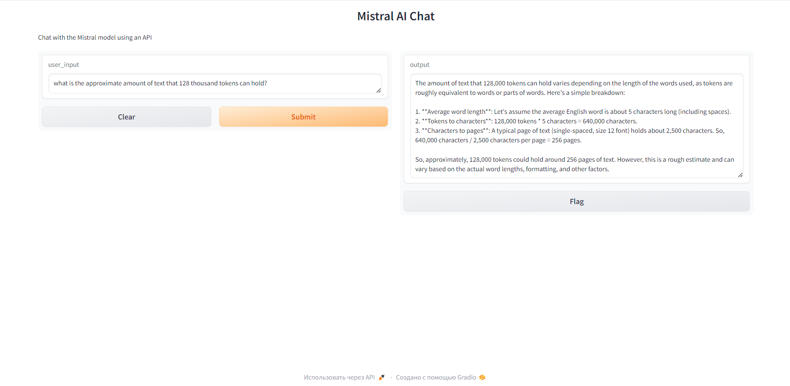

# Mistral inference API with Gradio


Clone repository:
```
git clone https://github.com/ivangolt/mistral_inference_api.git

```

Install dependencies:
```
poetry shell
```

```
poetry install
```

Run application:
```
cd /mistral_inference_api
```

```
python mistral.py
```


Application:

<p align="center">
    
</p>
